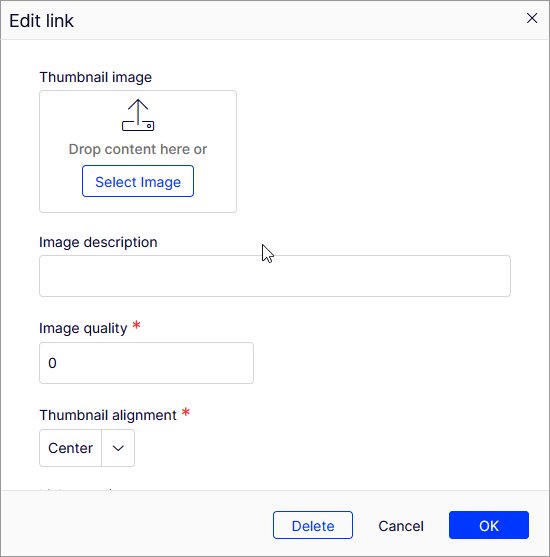

# Implement a link data collection featuring a thumbnail



## Inherit LinkData

First, implement a class inheriting from `LinkData`. Lets call it `ThumbnailLinkData`.

Since backing data is stored in a `Dictionary<string, string>` called `Attributes`.
Properties need to read and write from that.
This can be achieved by using the various overloads for the method `GetAttribute` and `SetAttribute` like illustrated below.
Dictionary key resolution and null values are handled behind the scenes.

```
public class ThumbnailLinkData : LinkData
{
    [Display(Name = "Thumbnail image", Order = 0)]
    [UIHint("image")]
    public virtual ContentReference Thumbnail
    {
        get => GetAttribute((v) => ContentReference.Parse(v));
        set => SetAttribute(value, (v) => v.ToString());
    }

    [Display(Name = "Image description", Order = 10)]
    public virtual string ThumbnailAlt
    {
        get => GetAttribute();
        set => SetAttribute(value);
    }

    [Display(Name = "Image quality", Order = 20)]
    public virtual double ThumbnailQuality
    {
        get => GetAttribute(Convert.ToDouble);
        set => SetAttribute(Convert.ToString(value));
    }
}
```

More details on handling properties and property support can be found [here](./advanced-property-handling.md).

## Create a property definition

Create a property definition that inherits from `PropertyLinkDataCollection` using your `LinkData` implementation as a generic type parameter.

```
[PropertyDefinitionTypePlugIn(DisplayName = "Link collection with thumbnails", GUID = "9f711ce6-ee75-466c-ab9c-67b65a85abc1")]
public class PropertyThumbnailCollection : PropertyLinkDataCollection<ThumbnailLinkData>
{

}
```

## Define a property on another content model

Define a new property with `LinkDataCollection<ThumbnailLinkData>` on content.
The backing type will resolve automatically.

```
[CultureSpecific]
[Display(Name = "Thumbnail links", Order = 230)]
public virtual LinkDataCollection<ThumbnailLinkData> Thumbnails { get; set; }
```


## Register type for import/export

In Startup.cs

```
public void ConfigureServices(IServiceCollection services)
{
    ...
    services.AddLinkDataExportTransform<ThumbnailLinkData>();
}
```
