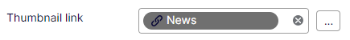

# Implement a single link data property featuring a thumbnail

If you haven't already, please read the guide on how to create a [collection property](example-link-data-collection.md) before continuing.

## Inherit LinkData

Repeat or reuse the steps on inheriting from `LinkData` from the previous guide.

## Create a property definition

Create a property definition that inherits from `PropertyLinkData` using your `LinkData` implementation as a generic type parameter.

```
[PropertyDefinitionTypePlugIn(DisplayName = "Link with thumbnail", GUID = "256acbba-100b-4f60-8e2b-08b399036228")]
public class PropertyThumbnail : PropertyLinkData<ThumbnailLinkData>
{

}
```

## Define a property on another content model

Define a new property with `LinkDataCollection<ThumbnailLinkData>` on content.
The backing type will resolve automatically.

```
[CultureSpecific]
[Display(Name = "Thumbnail link", Order = 240)]
public virtual ThumbnailLinkData Thumbnail { get; set; }
```


